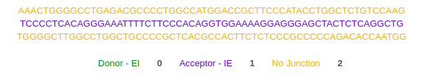
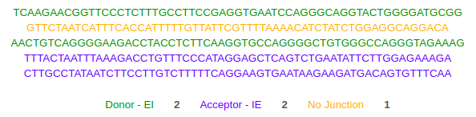

#### Project Structure

```
├── data                 # Data Splice Junction 
├── src                  # SRC contain scripts for training and testing
├── visualization        # ROC curve on training data/
├── weight               # Weight used in prediction/
├── Readme               # Readme for dna-level splice junction/
├── requiremnts          # Requirements file dna-level splice junction/

```
    

#### Dataset description

The domain consists of 60 variables, representing a sequence of DNA bases an additional class Variable.
The task is to determine if the middle of the sequence is a splice junction and what is its type:
Splice junctions are of two types:

1. exon-intron (EI): represents the end of an exon and the beginning of an intron

2. intron-exon (IE):  represents where the intron ends and the next exon, or coding section, begins.

So the class variable contains 3 values:

1. exon-intron (EI)

2. intron-exon (IE)

3. No-Junction

Other 4 values corresponding to the 4 possible DNA bases (C, A, G, T)

```C : Cytosine```

```A : Adenine```

```G : Guanine```

```T : Thymine```

Length of gene sequence must be : multiple of 60

The dataset consists of 3,175 labeled examples. We use 5 fold cross validation to train and validate our model.

Here, the data set is split into 5 folds. In the first iteration, the first fold is used to test the model and the rest are used to train the model. In the second iteration, 2nd fold is used as the testing set while the rest serve as the training set. This process is repeated until each fold of the 5 folds have been used as the testing set.

3-words: codons

 Let’s again assume a sequence L of independent bases

##### L = TCCCTCTGTTGCCCTCTGGTTTCTCCCCAGGCTCCCGGACGTCCCTGCTCCTGGCTTTTG

 Probability of 3-word r1, r2, r3 at position i, i+1, i+2 in sequence L is:

 P(Li = r1, Li+1 = r2, Li+2 = r3) = P(Li = r1)P(Li+1 = r2)P(Li+2 = r3)


#### Model Architectrue

Each DNA read is a sequence of four ```[C,A,G,T]``` types of nucleotides and needs to be converted into numerical representations for machine learning.

LSTM - Long Short Term Memory.


#### Running ML training and inference

Install packages required by `models`


```$ pip install -r requirements.txt```


#### Input Output Example

`Input`

Gene sequence will be raw text multiple of 60x. containing A,C,G,T

`Output:`

Predicted Gene sequence equal length of input.

Every `60x` will be either `Donor-IE`,  `Acceptor-EI` or  `No-Junction`.

##### Example 1:
[input2](data)

##### Output:



##### Example 2:
[input7](data)

##### Output:




#### Run scripts

`python app.py`

#### Accuracy: 99.27 %

#### References:

#### Research Paper Reference for this repository:

1. [DNA-Level Splice Junction Prediction using Deep
Recurrent Neural Networks](https://arxiv.org/pdf/1512.05135.pdf)

2. [Classification of eukaryotic splice-junction genetic sequences using
averaged one-dependence estimators with subsumption resolution](https://core.ac.uk/download/pdf/82482313.pdf)

#### Dataset Links

[Splice-Gene-Dataste - Dataset Links](http://www.jmlr.org/papers/volume1/meila00a/html/node32.html)


